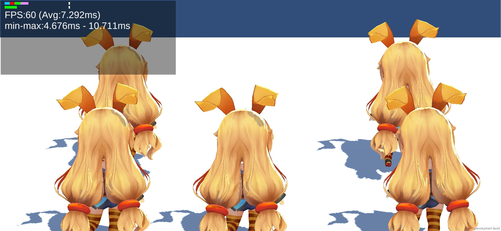
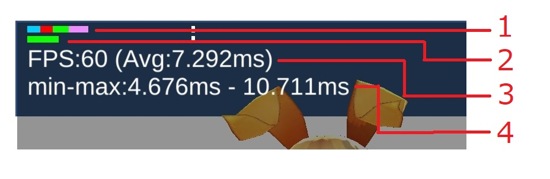

# MainLoopProfilingSample
Read this in other languages: English, [日本語](README.ja.md) 

## About

Simple runtime profiling tool using "PlayerLoop(Unity 2018.1)". <br/ >
You can see execute time by category at runtime (left top of the screen).

## Meter

<pre>
1. MainThread execute time meter.
 blue：Script
 orange：Physics
 red：Animator
 green：Render
 purple：Other

2.RenderThread execute time meter.

3.Latest 1 sec framerate information.
4.Latest 1 sec minimum/maximum execute time for 1 frame.

</pre>
